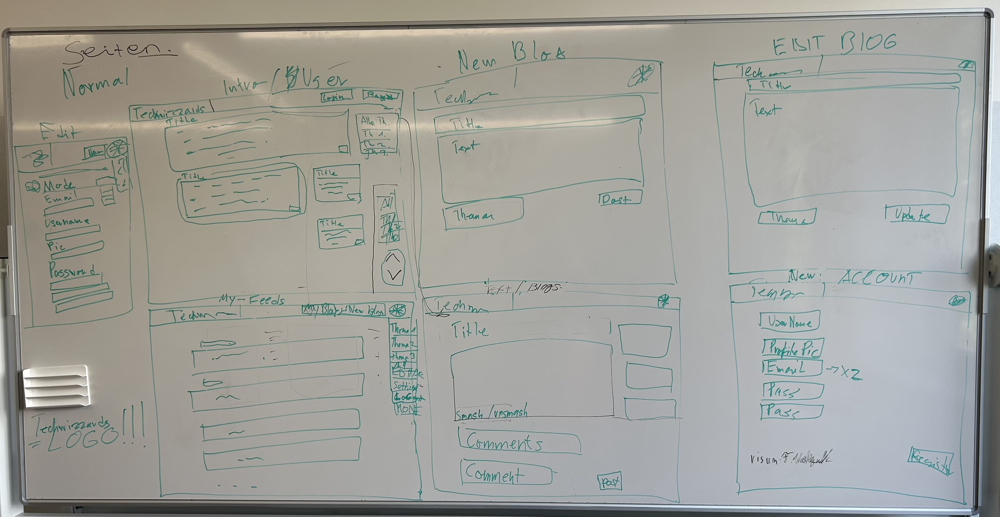
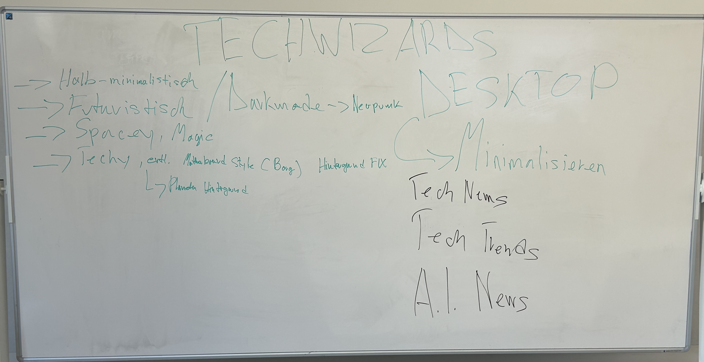
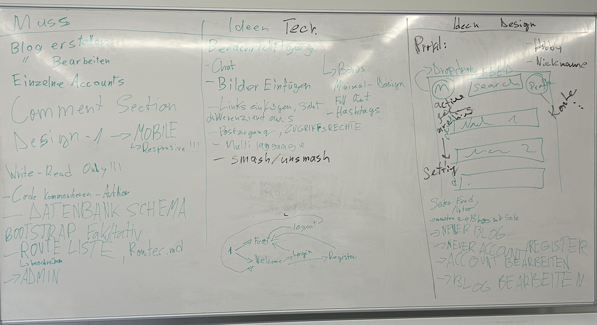

# TECHWIZZARDS

###### TECHWIZZARDS is a News/Blog Page about the newest Stuff in the Tech World

## NEWS/FEED CATEGORIES

-	TECH NEWS
-	TECH TRENDS
-	A.I. NEWS
-   MAIN/ALL

## SITE FEATURES

-	Read newest Blogs/News Posts from different categories
-	Create and Post own Blogs
-	Rate and comment on Posts

## BAREBONES

### WIREFRAME:

### PAGES:

-	Index/Welcome
-	My Feeds
-	New Blog
-	Edit Blog
-	New Account
-	Edit Account
-	Post/Feed (One actual Feed)

## FURTHER SKETCHES/BRAINSTORM IDEAS

## PAGE DESCRIPTIONS

###   Index/Welcome Page (/index) index.blade.php

The Index page shows all the feeds(in chronological order)

-   It allows the user to choose which News/Feed category is shown
-   The User can click on any Post Title or Content and is redirected to (/post) post.blade.php

###   New Account Page (/register) register.blade.php

The New Account Page lets the Guest create a new User Account with the following User Details/settings:

-   Username
-   MAYBE Profile Picture
-   eMail
-   Password

###   Edit Account Page (/edit_acc) edit_acc.blade.php

The Edit Account Page lets the User edit following account settings:

-   Username
-   Profile Picture
-   eMail
-   Password
-   eMail and Password must be entered twice and both inputs have to be the same
-   if User is not logged in it redirects to the register page

###   New Blog Page (/new_blog) new_blog.blade.php

The New Blog Page lets the User create a new Post containing the following:

-   Title
-   Content
-   Category

###   Edit Blog Page (/edit_blog) edit_blog.blade.php

The Edit Blog Page lets the User do the following to a Post:

-   Edit Title
-   Edit Content
-   Edit Category
-   Edit DELETE POST

###   View Post Page (/post) post.blade.php

The View Post Page lets the User do the following:

-   View the Post Title
-   View the Post content
-   MABY View the 3 newest Blogs/Posts on the Site
-   View comments on the Post
-   MAYBE Like or Dislike the Post
-   Post a comment on the Post

### My Feeds Page (/my_feeds) my_feeds.blade.php

The My Feeds Page lets the User do the following:

-   View own Posts
-   View own Posts by category
-   Go to (/edit_blog) by clicking on Post Title or Content
-   MAYBE Delete Posts(by ID)

### MIGRATE THE DATABASE:

    sail artisan migrate

### ADD THE SEEDS TO DATABASE:

first update the User table to the DB 

    sail artisan db:seed --class=UserSeeder
    
Then update the Post table to the DB

    sail artisan db:seed --class=PostSeeder

Then update the Comments table to the DB

    sail artisan db:seed --class=CommentSeeder

### Standard Login

-   Login:  vorname n@example.ch
    Login consists of: First Name, Last Name capital Letter, @example.ch

-   Password:   password123

### Ideas

-   Posts Public/Private
-   Notifications
-   Chat
-   Add Profile Picture
-   Add Links

-   Multi-Language
-   Smash/Unsmash
-   Hashtag
-   Multidesign
-   Profile Picture

